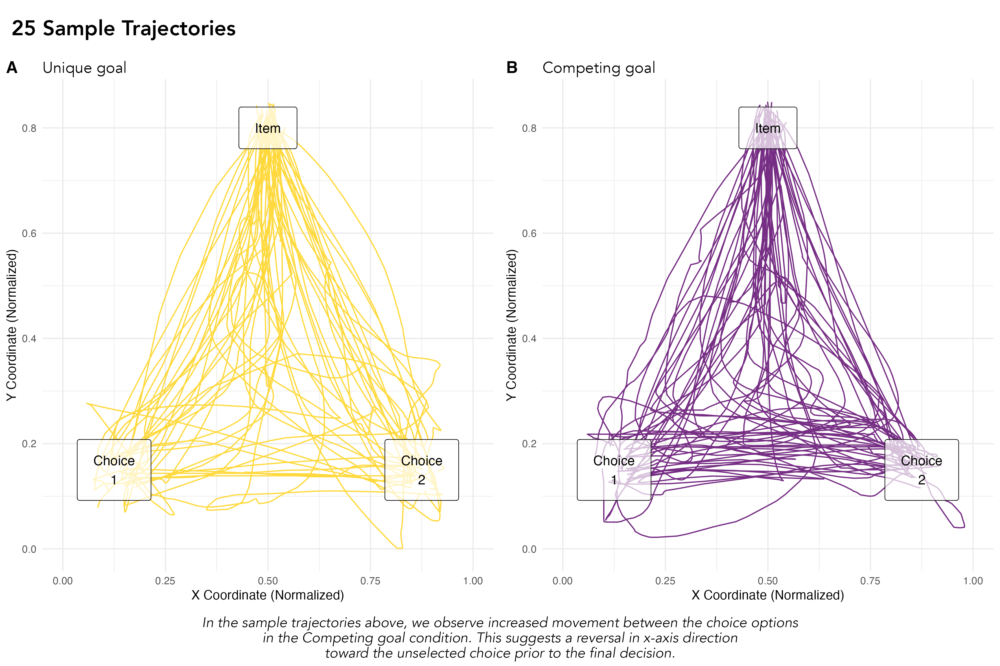
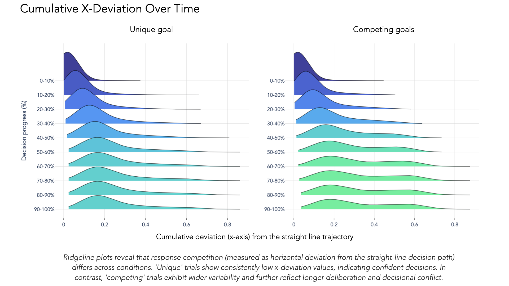
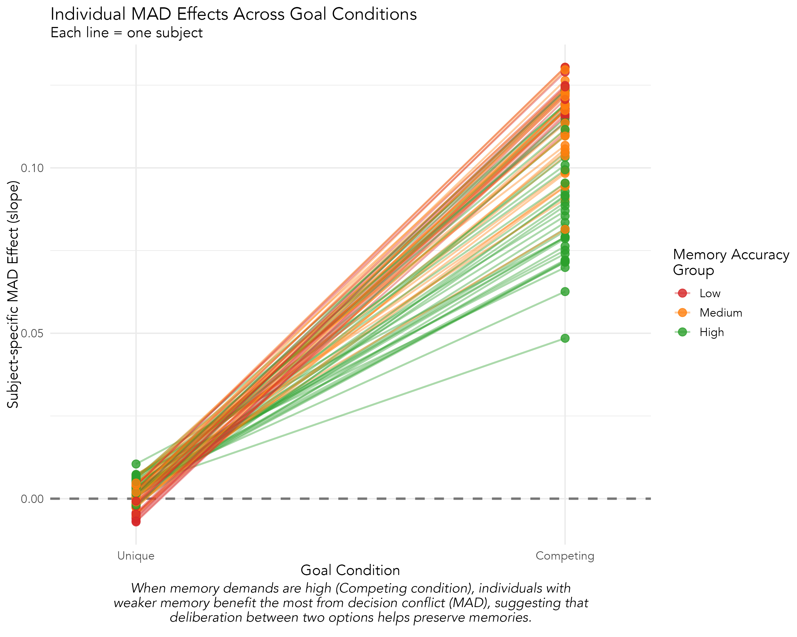

# Decisional conflict & memory project
## Summary
In everyday life, we are constantly faced with conflicting choices. Although some research has investigated how such decisions are made, it remains unknown how dynamic processes that arise during complex decisions shapes our memory for these choices later on.

## Project Overview
In this project, participants saw an item and decided whether it satisfied one of two possible goals (a hiking trip or a beach vacation). In the 'Unique' (low complexity) scenario, an item could satisfy only one goal (e.g., trekking poles for a hiking trip), while in the 'Competing' (high complexity) scenario, an item could satisfy either goal (e.g., water bottle for a hiking trip OR a beach vacation). We then tracked their mouse movement to understand how decisional conflict influenced their subsequent memory for these objects. 

## Highlights 
### → Raw mousetracking trajectories for low vs. high complexity decisions 

### → Response competition evolves over decision time course

### → Decisional conflict boosts memory for low performers 

## Repository structure
*Data*    
+ /data/raw: Contains the raw mousetracking and memory accuracy data.    
+ /data/processed: Includes the cleaned and processed mousetracking and memory data. 

*Scripts*   
+ /notebooks/preprocessing: Contains scripts used to process mousetracking and memory test responses. Mousetracking trajectories were resampled to 20 ms intervals and interpolated to handle missing points when the mouse was stationary. Additionally, trajectoties were time normalized to allow for trial-by-trial comparison. Trials on the memory test were filtered to include correct decisions (in accordance with task instructions). 

+ /notebooks/analyses: Consists of scripts used to analyze the influence of decisional conflict on memory. 

+ /notebooks/visualizations: Includes analysis visualizations.
